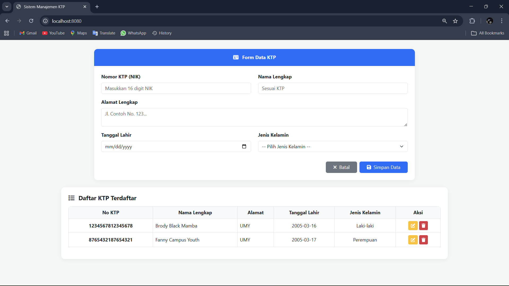
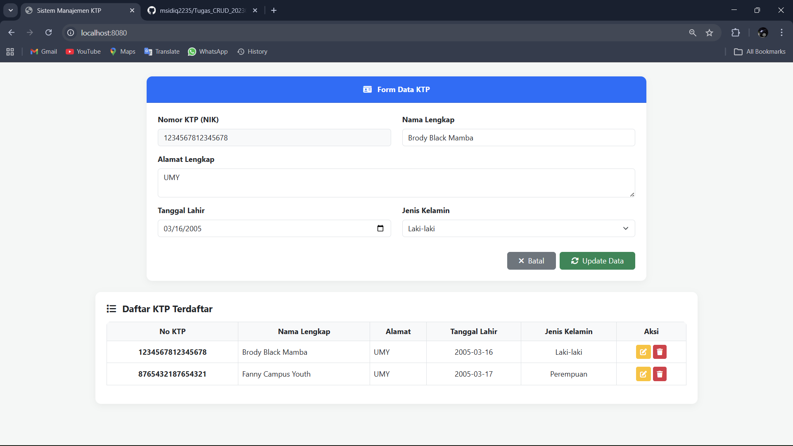
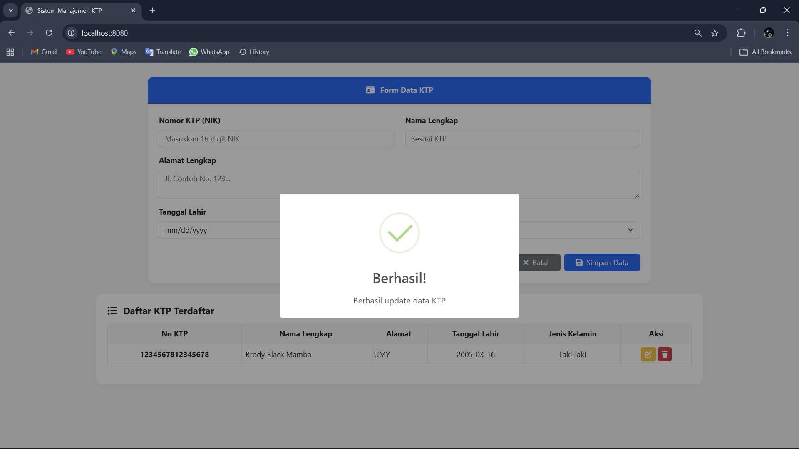
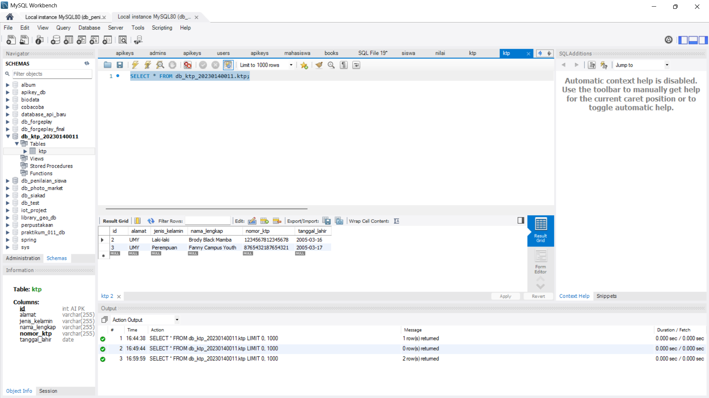

# Tugas Full-Stack: CRUD KTP (Spring Boot & AJAX)

Repositori ini berisi penyelesaian tugas pembuatan aplikasi berbasis web untuk Manajemen Data KTP menggunakan arsitektur REST API dengan Spring Boot di sisi *backend* dan HTML/jQuery AJAX di sisi *client*.

**Disusun Oleh:**
* **Nama:** Muhammad Sidiq
* **NIM:** 20230140011
* **Kelas:** TI A

---

## 🛠️ Teknologi yang Digunakan
* **Backend:** Java, Spring Boot 3.x, Spring Data JPA
* **Database:** MySQL
* **Frontend:** HTML5, Bootstrap 5 (CSS Framework)
* **Interaktivitas:** JavaScript, jQuery (AJAX), SweetAlert2 (Notifikasi)
* **Lainnya:** Maven, Git, GitHub

---

## 🗄️ Struktur Database
Aplikasi ini menggunakan database MySQL. Tabel `KTP` di-generate secara otomatis oleh Hibernate (JPA) dengan struktur berikut:

| Nama Kolom | Tipe Data | Keterangan |
| :--- | :--- | :--- |
| `id` | INT | Primary Key, Auto Increment |
| `nomorKtp` | VARCHAR | Unique, Not Null |
| `namaLengkap` | VARCHAR | - |
| `alamat` | VARCHAR | - |
| `tanggalLahir` | DATE | - |
| `jenisKelamin` | VARCHAR | - |

---

## 📡 Dokumentasi REST API

Base URL: `http://localhost:8080`

### 1. Tambah Data KTP Baru
* **Endpoint:** `POST /`
* **Body Request (JSON):**
  ```json
  {
    "nomorKtp": "1234567812345678",
    "namaLengkap": "Brody Black Mamba",
    "alamat": "UMY",
    "tanggalLahir": "2005-03-16",
    "jenisKelamin": "Laki-laki"
  }

  ```

### 2. Ambil Semua Data KTP

* **Endpoint:** `GET /`
* **Response:** Array of Object berisi seluruh data KTP.

### 3. Ambil Data KTP Berdasarkan ID

* **Endpoint:** `GET /{id}`
* **Response:** Mengembalikan single object data KTP berdasarkan ID yang diminta.

### 4. Perbarui Data KTP

* **Endpoint:** `PUT /{id}`
* **Body Request (JSON):** Sama seperti format POST. (Catatan: nomorKtp dikunci di frontend agar tidak dapat diubah).

### 5. Hapus Data KTP

* **Endpoint:** `DELETE /{id}`
* **Response:** Pesan konfirmasi data berhasil dihapus.

---

##  Screenshot


### Tampilan Form & Tabel Data 

### Tampilan Saat Mengedit Data 

### Tampilan Notifikasi 

### Tampilan Database

### Screenshot Kelengkapan Package

---